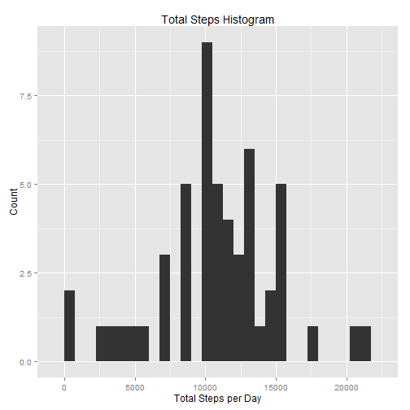
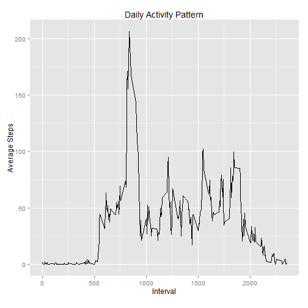
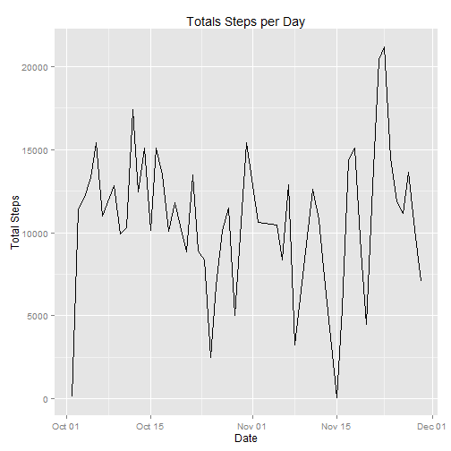
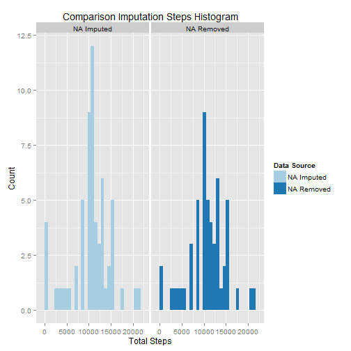
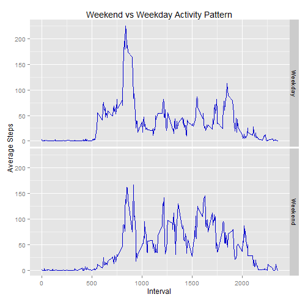

##Reproducible Research: *Peer Assessment 1*

###Introduction

It is now possible to collect a large amount of data about personal movement using activity monitoring devices such as a Fitbit, Nike Fuelband, or Jawbone Up. These type of devices are part of the "quantified self" movement -- a group of enthusiasts who take measurements about themselves regularly to improve their health, to find patterns in their behavior, or because they are tech geeks. But these data remain under-utilized both because the raw data are hard to obtain and there is a lack of statistical methods and software for processing and interpreting the data.

This assignment makes use of data from a personal activity monitoring device. This device collects data at 5 minute intervals through out the day. The data consists of two months of data from an anonymous individual collected during the months of October and November, 2012 and include the number of steps taken in 5 minute intervals each day.

###Loading and Preprocessing Data
First I load the packages I'll be utilizing for analysis.


```r
library(dplyr)
library(tidyr)
library(lubridate)
library(ggplot2)
library(RColorBrewer)
library(chron)
```

I begin by extracting the csv from the zip file provided in the Github Repo. I first check to see if a folder exists in the current working directory. If not the folder is created.


```r
if(!file.exists("./data")){dir.create("./data")}
```

Then I check to see if the file already exists in the data folder. If not it is extracted to the data folder.


```r
if(!file.exists("./data/activity.csv")) {
     unzip("./activity.zip"
           , exdir = "./data")   
}
```

Finally I load the data to a variable as a tbl_df from the dplyr package.

####1. Load the data (i.e. read.csv())


```r
activitydata <- tbl_df(read.csv("./data/activity.csv"))
```

After loading the data I view the data to better understand if any further processing will be required.

####2. Process/transform the data (if necessary) into a format suitable for your analysis


```r
activitydata
```

```
## Source: local data frame [17,568 x 3]
## 
##    steps       date interval
## 1     NA 2012-10-01        0
## 2     NA 2012-10-01        5
## 3     NA 2012-10-01       10
## 4     NA 2012-10-01       15
## 5     NA 2012-10-01       20
## 6     NA 2012-10-01       25
## 7     NA 2012-10-01       30
## 8     NA 2012-10-01       35
## 9     NA 2012-10-01       40
## 10    NA 2012-10-01       45
## ..   ...        ...      ...
```

```r
str(activitydata)
```

```
## Classes 'tbl_df', 'tbl' and 'data.frame':	17568 obs. of  3 variables:
##  $ steps   : int  NA NA NA NA NA NA NA NA NA NA ...
##  $ date    : Factor w/ 61 levels "2012-10-01","2012-10-02",..: 1 1 1 1 1 1 1 1 1 1 ...
##  $ interval: int  0 5 10 15 20 25 30 35 40 45 ...
```

```r
summary(activitydata)
```

```
##      steps                date          interval     
##  Min.   :  0.00   2012-10-01:  288   Min.   :   0.0  
##  1st Qu.:  0.00   2012-10-02:  288   1st Qu.: 588.8  
##  Median :  0.00   2012-10-03:  288   Median :1177.5  
##  Mean   : 37.38   2012-10-04:  288   Mean   :1177.5  
##  3rd Qu.: 12.00   2012-10-05:  288   3rd Qu.:1766.2  
##  Max.   :806.00   2012-10-06:  288   Max.   :2355.0  
##  NA's   :2304     (Other)   :15840
```

At this point I see no reason to further process the data.

###What is mean total number of steps taken per day?
Initially we intend to learn more about the daily usage of the device. This begins with a histogram of the total steps taken each day and to calculate the mean and median steps per day.

####1. Calculate the total number of steps taken per day
First I create a summarized data frame that removes NA values and view the summary information.


```r
summaryactivitydate <- activitydata %>%
                        filter(!is.na(steps)) %>%
                        group_by(date) %>%
                        summarise(mean_steps = mean(steps),
                                  median_steps = median(steps),
                                  total_steps = sum(steps))
summaryactivitydate
```

```
## Source: local data frame [53 x 4]
## 
##          date mean_steps median_steps total_steps
## 1  2012-10-02    0.43750            0         126
## 2  2012-10-03   39.41667            0       11352
## 3  2012-10-04   42.06944            0       12116
## 4  2012-10-05   46.15972            0       13294
## 5  2012-10-06   53.54167            0       15420
## 6  2012-10-07   38.24653            0       11015
## 7  2012-10-09   44.48264            0       12811
## 8  2012-10-10   34.37500            0        9900
## 9  2012-10-11   35.77778            0       10304
## 10 2012-10-12   60.35417            0       17382
## ..        ...        ...          ...         ...
```

```r
str(summaryactivitydate)
```

```
## Classes 'tbl_df', 'tbl' and 'data.frame':	53 obs. of  4 variables:
##  $ date        : Factor w/ 61 levels "2012-10-01","2012-10-02",..: 2 3 4 5 6 7 9 10 11 12 ...
##  $ mean_steps  : num  0.438 39.417 42.069 46.16 53.542 ...
##  $ median_steps: num  0 0 0 0 0 0 0 0 0 0 ...
##  $ total_steps : int  126 11352 12116 13294 15420 11015 12811 9900 10304 17382 ...
##  - attr(*, "drop")= logi TRUE
```

```r
summary(summaryactivitydate)
```

```
##          date      mean_steps       median_steps  total_steps   
##  2012-10-02: 1   Min.   : 0.1424   Min.   :0     Min.   :   41  
##  2012-10-03: 1   1st Qu.:30.6979   1st Qu.:0     1st Qu.: 8841  
##  2012-10-04: 1   Median :37.3785   Median :0     Median :10765  
##  2012-10-05: 1   Mean   :37.3826   Mean   :0     Mean   :10766  
##  2012-10-06: 1   3rd Qu.:46.1597   3rd Qu.:0     3rd Qu.:13294  
##  2012-10-07: 1   Max.   :73.5903   Max.   :0     Max.   :21194  
##  (Other)   :47
```

####2. Make a histogram of the total number of steps taken each day
Then make a histogram of the total number of steps taken each day.


```r
g <- ggplot(summaryactivitydate, aes(total_steps))
g + geom_histogram(binwidth = 750) + labs(title = "Total Steps Histogram", x = "Total Steps per Day", y = "Count")
```

 

This result shows that the majority of the daily steps taken fall between 10k and 15k steps per day.

####3. Calculate and report the mean and median of the total number of steps taken per day
Taking a summary of the data frame confirms what we see in the graph with a Median and Mean value just above 10k steps.


```r
summary(summaryactivitydate$total_steps)[c("Mean", "Median")]
```

```
##   Mean Median 
##  10770  10760
```

###What is the average daily activity pattern?
In order to better understand at what points in the day are the most activity occuring we can plot a time series the average steps taken during each daily interval.

####1. Make a time series plot (i.e. type = "l") of the 5-minute interval (x-axis) and the average number of steps taken, averaged across all days (y-axis)


```r
summaryactivityinterval <- activitydata %>%
                        filter(!is.na(steps)) %>%
                        group_by(interval) %>%
                        summarise(mean_steps = mean(steps),
                                  median_steps = median(steps),
                                  total_steps = sum(steps))

g <- ggplot(summaryactivityinterval, aes(interval, mean_steps))
g + geom_line() + labs(title = "Daily Activity Pattern", x = "Interval
                       ", y = "Average Steps")
```

 

####2. Which 5-minute interval, on average across all the days in the dataset, contains the maximum number of steps?
It appears that the maximum average occurs at the interval 835.


```r
arrange(summaryactivityinterval, desc(mean_steps))[1,]
```

```
## Source: local data frame [1 x 4]
## 
##   interval mean_steps median_steps total_steps
## 1      835   206.1698           19       10927
```

###Imputing missing values
Since NA values can introduce bias to our calculations we should compare results to data without NA values. To do this we will impute the values. First we check to see how many NA's are in our dataset.

####1. Calculate and report the total number of missing values in the dataset (i.e. the total number of rows with NAs)


```r
summary(activitydata)
```

```
##      steps                date          interval     
##  Min.   :  0.00   2012-10-01:  288   Min.   :   0.0  
##  1st Qu.:  0.00   2012-10-02:  288   1st Qu.: 588.8  
##  Median :  0.00   2012-10-03:  288   Median :1177.5  
##  Mean   : 37.38   2012-10-04:  288   Mean   :1177.5  
##  3rd Qu.: 12.00   2012-10-05:  288   3rd Qu.:1766.2  
##  Max.   :806.00   2012-10-06:  288   Max.   :2355.0  
##  NA's   :2304     (Other)   :15840
```

It appears there are 2304 NA values in our dataset. For simplicity I will impute the missing values with the mean by interval calculated before. However before doing that I want to determine if there will be any potential issues with this approach. I first look to see what the daily activity is.

####2. Devise a strategy for filling in all of the missing values in the dataset.


```r
table(activitydata$date[is.na(activitydata$steps)])
```

```
## 
## 2012-10-01 2012-10-02 2012-10-03 2012-10-04 2012-10-05 2012-10-06 
##        288          0          0          0          0          0 
## 2012-10-07 2012-10-08 2012-10-09 2012-10-10 2012-10-11 2012-10-12 
##          0        288          0          0          0          0 
## 2012-10-13 2012-10-14 2012-10-15 2012-10-16 2012-10-17 2012-10-18 
##          0          0          0          0          0          0 
## 2012-10-19 2012-10-20 2012-10-21 2012-10-22 2012-10-23 2012-10-24 
##          0          0          0          0          0          0 
## 2012-10-25 2012-10-26 2012-10-27 2012-10-28 2012-10-29 2012-10-30 
##          0          0          0          0          0          0 
## 2012-10-31 2012-11-01 2012-11-02 2012-11-03 2012-11-04 2012-11-05 
##          0        288          0          0        288          0 
## 2012-11-06 2012-11-07 2012-11-08 2012-11-09 2012-11-10 2012-11-11 
##          0          0          0        288        288          0 
## 2012-11-12 2012-11-13 2012-11-14 2012-11-15 2012-11-16 2012-11-17 
##          0          0        288          0          0          0 
## 2012-11-18 2012-11-19 2012-11-20 2012-11-21 2012-11-22 2012-11-23 
##          0          0          0          0          0          0 
## 2012-11-24 2012-11-25 2012-11-26 2012-11-27 2012-11-28 2012-11-29 
##          0          0          0          0          0          0 
## 2012-11-30 
##        288
```

```r
summaryactivitydate$date <- ymd(summaryactivitydate$date)


g <- ggplot(summaryactivitydate, aes(date, total_steps))
g + geom_line() + labs(title = "Totals Steps per Day", x = "Date", y = "Total Steps")
```

 

It appears that the first and last days are likely inactive. As such they will be imputed with zero. Then the remaining missing values will be imputed by replacing with inverval means.

####3. Create a new dataset that is equal to the original dataset but with the missing data filled in.


```r
activitydataimpute <- activitydata
activitydataimpute$date <- ymd(activitydataimpute$date)

activitydataimpute <- activitydataimpute %>% 
                  left_join(summaryactivityinterval, by = c("interval" = "interval"))

activitydataimpute$steps[activitydataimpute$date == ymd("2012-10-01")] <- 0
activitydataimpute$steps[activitydataimpute$date == ymd("2012-11-29")] <- 0
activitydataimpute$steps[is.na(activitydataimpute$steps)] <- round(activitydataimpute$mean_steps[is.na(activitydataimpute$steps)], 0)

activitydataimpute <- activitydataimpute %>% select(1:3)

summary(activitydata)
```

```
##      steps                date          interval     
##  Min.   :  0.00   2012-10-01:  288   Min.   :   0.0  
##  1st Qu.:  0.00   2012-10-02:  288   1st Qu.: 588.8  
##  Median :  0.00   2012-10-03:  288   Median :1177.5  
##  Mean   : 37.38   2012-10-04:  288   Mean   :1177.5  
##  3rd Qu.: 12.00   2012-10-05:  288   3rd Qu.:1766.2  
##  Max.   :806.00   2012-10-06:  288   Max.   :2355.0  
##  NA's   :2304     (Other)   :15840
```

```r
summary(activitydataimpute)
```

```
##      steps             date               interval     
##  Min.   :  0.00   Min.   :2012-10-01   Min.   :   0.0  
##  1st Qu.:  0.00   1st Qu.:2012-10-16   1st Qu.: 588.8  
##  Median :  0.00   Median :2012-10-31   Median :1177.5  
##  Mean   : 36.37   Mean   :2012-10-31   Mean   :1177.5  
##  3rd Qu.: 24.00   3rd Qu.:2012-11-15   3rd Qu.:1766.2  
##  Max.   :806.00   Max.   :2012-11-30   Max.   :2355.0
```

After imputing NA's it's time to compare our original results to the new ones.

####4a. Make a histogram of the total number of steps taken each day and Calculate and report the mean and median total number of steps taken per day.


```r
summaryactivityimpute <- activitydataimpute %>%
                              group_by(date) %>%
                              summarise(mean_steps = mean(steps),
                                          median_steps = median(steps),
                                          total_steps = sum(steps))

summaryactivitydate <- mutate(summaryactivitydate, src="NA Removed")
summaryactivityimpute <- mutate(summaryactivityimpute, src="NA Imputed")
combined <- rbind(summaryactivitydate, summaryactivityimpute)

g <- ggplot(combined, aes(total_steps, fill = src))
g + geom_histogram(binwidth = 750) + 
      facet_grid(~src) +
      labs(title = "Comparison Imputation Steps Histogram",
           y = "Count"
           ,x = "Total Steps"
           ,fill = "Data Source") +
      scale_fill_brewer(palette = "Paired")
```

 

####4b. Do these values differ from the estimates from the first part of the assignment? What is the impact of imputing missing data on the estimates of the total daily number of steps?

As the plot above shows, imputing data increased the volumes of all total steps. Additionally mean total steps changed while median total steps remained nearly identical.


```r
combined %>% group_by(src) %>% summarise(mean(total_steps), median(total_steps))
```

```
## Source: local data frame [2 x 3]
## 
##          src mean(total_steps) median(total_steps)
## 1 NA Imputed          10473.69               10762
## 2 NA Removed          10766.19               10765
```

###Are there differences in activity patterns between weekdays and weekends?
The last step of analysis will be to see how the activity patterns change between weekdays and weekends. We'll begin by modifying our imputed dataset to identify which days are weekdays and which are weekends.

####1. Create a new factor variable in the dataset with two levels - "weekday" and "weekend" indicating whether a given date is a weekday or weekend day.


```r
summaryactivityimputeweekday <- activitydataimpute %>%
                                    mutate(Weekday_Type = factor(ifelse(is.weekend(date) == TRUE, "Weekend", "Weekday"))) %>%
                                    group_by(Weekday_Type, interval) %>%
                                    summarise(mean_steps = mean(steps),
                                          median_steps = median(steps),
                                          total_steps = sum(steps))

str(summaryactivityimputeweekday)
```

```
## Classes 'grouped_df', 'tbl_df', 'tbl' and 'data.frame':	576 obs. of  5 variables:
##  $ Weekday_Type: Factor w/ 2 levels "Weekday","Weekend": 1 1 1 1 1 1 1 1 1 1 ...
##  $ interval    : int  0 5 10 15 20 25 30 35 40 45 ...
##  $ mean_steps  : num  2.2444 0.4 0.1556 0.1778 0.0889 ...
##  $ median_steps: num  0 0 0 0 0 0 0 0 0 0 ...
##  $ total_steps : num  101 18 7 8 4 69 33 51 0 77 ...
##  - attr(*, "vars")=List of 1
##   ..$ : symbol Weekday_Type
##  - attr(*, "drop")= logi TRUE
```

####2. Make a panel plot containing a time series plot (i.e. type = "l") of the 5-minute interval (x-axis) and the average number of steps taken, averaged across all weekday days or weekend days (y-axis).

Then we create a line plot comparing the two.


```r
g <- ggplot(summaryactivityimputeweekday, aes(interval, mean_steps))
g + geom_line(colour = "blue3") + 
      labs(title = "Weekend vs Weekday Activity Pattern", x = "Interval
                       ", y = "Average Steps") +
      facet_grid(Weekday_Type~.)
```

 

Looking at the result we see that on weekdays there appears to be a few more steps on average in the beginning of the day followed by being fairly stationary. The weekends seem to have a little less morning activity but higher activity throughout the rest of the day.
